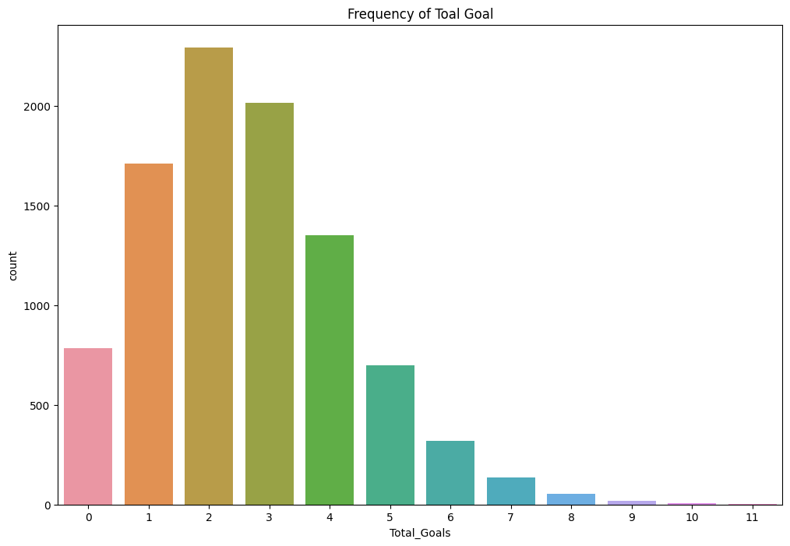
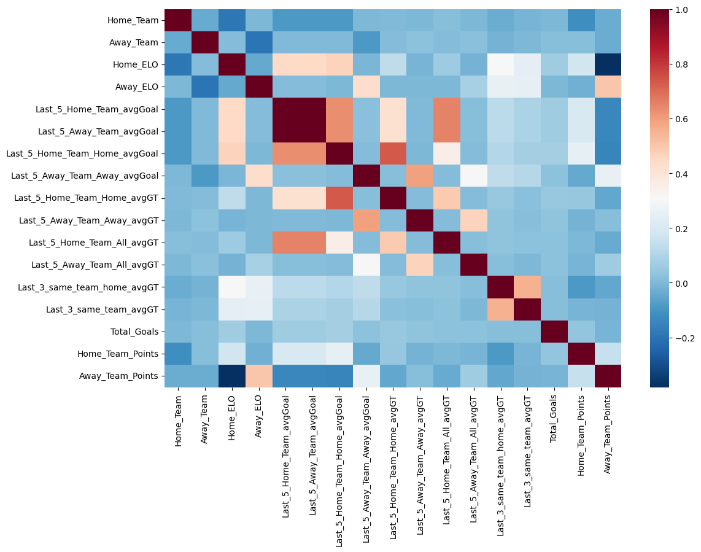
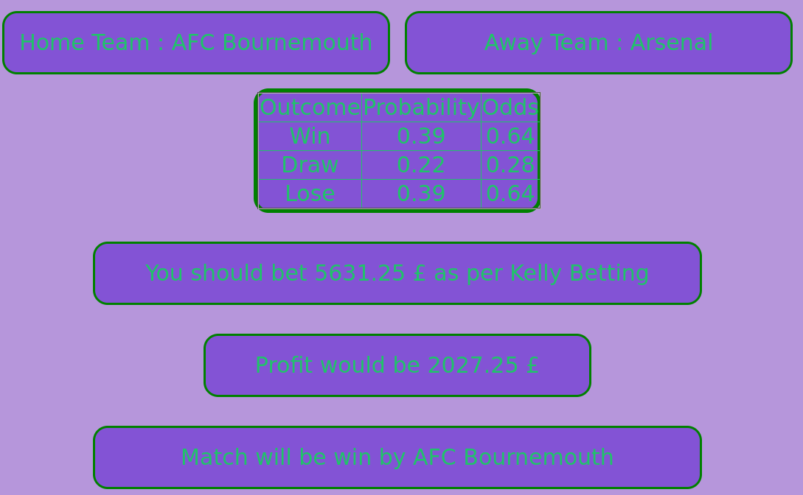
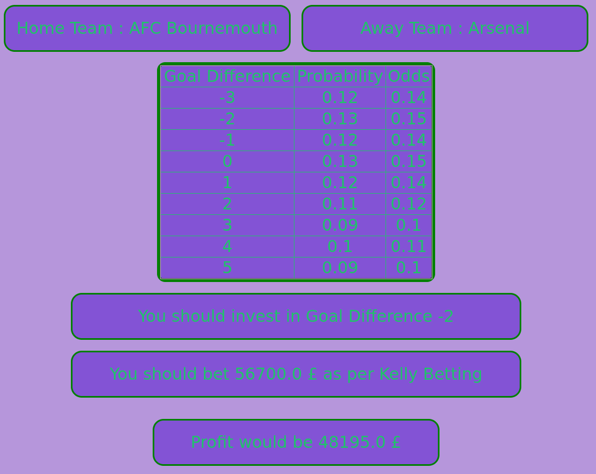

<h1 align="center">Kelly Betting & Foot Ball Prediction</h1>

<div align= "center">

<br/>

<h4>This is a Data Science project in which we are going to create a machine learning model to make prediction of a football match and betting prediction.</h4>
</div>

<br/>

# Table of Contents

- [Table of Contents](#table-of-contents)
- [⚠️ Frameworks and Libraries](#warning-frameworks-and-libraries)
- [📁 Datasets](#file_folder-datasets)
  - [🔄 Source](#-source)
  - [📈 Visualising data](#-visualising-data)
  - [🔥 Probability Measure](#-probability-measure)
  - [🚇 Cross-Entropy](#-cross-entropy)
- [📖 Data Preprocessing](#book-data-preprocessing)
- [🔑 Prerequisites](#key-prerequisites)
- [🚀&nbsp; Installation](#-installation)
- [💡 How to Run](#bulb-how-to-run)
- [📂 Directory Tree](#-directory-tree)
- [🔑 Results](#key-results)
- [👏 And it&#39;s done!](#clap-and-its-done)
- [🙋 Citation](#raising_hand-citation)
- [❤️ Owner](#heart-owner)
- [👀 License](#eyes-license)

<br/>

# ⚠️ Frameworks and Libraries

- **[Sklearn](https://scikit-learn.org/stable/):** Simple and efficient tools for predictive data analysis
- **[Matplotlib](https://matplotlib.org/) :** Matplotlib is a comprehensive library for creating static, animated, and interactive visualizations in Python.
- **[Numpy](https://numpy.org/):** Caffe-based Single Shot-Multibox Detector (SSD) model used to detect faces
- **[Pandas](https://pandas.pydata.org/):** pandas is a fast, powerful, flexible and easy to use open source data analysis and manipulation tool, built on top of the Python programming language.
- **[Seaborn](https://seaborn.pydata.org/):** pandas is a fast, powerful, flexible and easy to use open source data analysis and manipulation tool, built on top of the Python programming language.
- **[Pickle](https://docs.python.org/3/library/pickle.html):** The Pickle module implements binary protocols for serializing and de-serializing a Python object structure.

# 📁 Datasets

## 🔄 Source

The Dataset is available in this repository. Clone it and use it.

<br/>

## 📈 Visualising data

<p align="center">
  
</p>

<p align="center">
  
</p>

`<br/>`

# 📖 Data Preprocessing

Data pre-processing is an important step for the creation of a machine learning model. Initially, data may not be clean or in the required format for the model which can cause isleading outcomes. In pre-processing of data, we transform data into our required format. It is used to deal with noises, duplicates, and missing values of the dataset. Data pre- rocessing has the activities like importing datasets, splitting datasets, attribute scaling, etc. Preprocessing of data is required for improving the accuracy of the model.

# 🔑 Prerequisites

All the dependencies and required libraries are included in the file `<code>`requirements.txt `</code>` [See here](requirements.txt)

<br/>

# 🚀&nbsp; Installation

The Code is written in Python 3.7. If you don&rsquo;t have Python installed you can find it [here](https://www.python.org/downloads/). If you are using a lower version of Python you can upgrade using the pip package, ensuring you have the latest version of pip. To install the required packages and libraries, run this command in the project directory after [cloning](https://www.howtogeek.com/451360/how-to-clone-a-github-repository/) the repository:

1. Clone the repo

```bash
git clone https://github.com/Chaganti-Reddy/Kelly-Betting.git
```

2. Change your directory to the cloned repo

```bash
cd Kelly-Betting
```

3. Now, run the following command in your Terminal/Command Prompt to install the libraries required

```bash
python3 -m virtualenv kelly_b

source kelly_b/bin/activate

pip3 install -r requirements.txt

```

<br/>

# 💡 How to Run

1. Open terminal. Go into the cloned project directory and type the following command:

```bash
cd Deploy
python3 main.py
```

<br/>

# 📂 Directory Tree

```
.
├── assets
│   ├── 1.png
│   ├── 2.png
│   ├── GD.png
│   ├── GS.png
│   ├── main.jpg
│   └── outcome.png
├── Book1.twb
├── Data
│   ├── code4.ipynb
│   ├── test_data.csv
│   └── train_data.csv
├── Deploy
│   ├── app.yaml
│   ├── main.py
│   ├── model_prepped_dataset.csv
│   ├── model_prepped_dataset_modified.csv
│   ├── requirements.txt
│   ├── static
│   │   ├── odds_distribution.png
│   │   └── probability_distribution.png
│   └── templates
│       ├── index.html
│       ├── prediction1.html
│       ├── prediction2.html
│       └── prediction3.html
├── goal_difference_prediction
│   ├── AdaBoost.ipynb
│   ├── code2.ipynb
│   ├── comparison.ipynb
│   ├── data_prep.ipynb
│   ├── dataset2.csv
│   ├── DicisionTree.ipynb
│   ├── final_data.csv
│   ├── GaussianNB.ipynb
│   ├── KNeighbors.ipynb
│   ├── model_prepped_dataset.csv
│   ├── model_prepped_dataset.json
│   ├── odds_kelly.ipynb
│   ├── RandomForest.ipynb
│   ├── SVC.ipynb
│   ├── test_data.csv
│   ├── train_data.csv
│   └── XGBClassifier.ipynb
├── goal_difference_prediction2
│   ├── AdaBoost.ipynb
│   ├── code2.ipynb
│   ├── comparison.ipynb
│   ├── data_prep.ipynb
│   ├── dataset2.csv
│   ├── DecisionTree.ipynb
│   ├── final_data.csv
│   ├── GaussianNB.ipynb
│   ├── KNeighbors.ipynb
│   ├── model_prepped_dataset.csv
│   ├── model_prepped_dataset.json
│   ├── odds_kelly.ipynb
│   ├── RandomForest.ipynb
│   ├── test_data.csv
│   └── train_data.csv
├── goal_prediction
│   ├── AdaBoost.ipynb
│   ├── code3.ipynb
│   ├── comparison.ipynb
│   ├── data_analytics.ipynb
│   ├── data_prep.ipynb
│   ├── dataset3.csv
│   ├── DecisionTree.ipynb
│   ├── final_data.csv
│   ├── GaussianNB.ipynb
│   ├── KNeighbors.ipynb
│   ├── LogisticRegression.ipynb
│   ├── model_prepped_dataset.csv
│   ├── model_prepped_dataset.json
│   ├── RandomForest.ipynb
│   ├── SVC.ipynb
│   ├── test_data.csv
│   ├── train_data.csv
│   └── XGBClassifier.ipynb
├── k2148344_dissretation_draft.docx
├── model_prepped_dataset.csv
├── model_prepped_dataset.json
├── model_prepped_dataset_modified.csv
├── outcome_prediction
│   ├── AdaBoostClassifier.ipynb
│   ├── code1.ipynb
│   ├── comparison.ipynb
│   ├── data_prep.ipynb
│   ├── dataset1.csv
│   ├── DecisionTree.ipynb
│   ├── final_data.csv
│   ├── GaussianNB.ipynb
│   ├── KNeighborsClassifier.ipynb
│   ├── LogisticRegression.ipynb
│   ├── model_prepped_dataset.csv
│   ├── model_prepped_dataset.json
│   ├── odds_kelly.ipynb
│   ├── svc.ipynb
│   ├── test_data.csv
│   ├── train_data.csv
│   └── XGBClassifier.ipynb
├── requirements.txt
├── Team Ranking
│   ├── code.ipynb
│   ├── data.csv
│   ├── model_prepped_dataset.csv
│   └── team_ranking_analysis.ipynb
├── temp.ipynb
└── Total Goal Prediction
    ├── code3.ipynb
    ├── comparison.ipynb
    ├── data_analytics.ipynb
    ├── data_prep.ipynb
    ├── dataset3.csv
    ├── final_data.csv
    ├── model_prepped_dataset.csv
    ├── model_prepped_dataset.json
    ├── test_data.csv
    └── train_data.csv
```

<br/>

# 🔑 Results

**1. Prediction by Outcome**

<br/>

<p align="center">
  
</p>


**1. Prediction by Goal Difference**

<br/>

<p align="center">
  
</p>


**1. Prediction by Goals Scored**

<br/>

<p align="center">
  
</p>


# 👏 And it's done!

Feel free to mail me for any doubts/query
✉️ chagantivenkataramireddy1@gmail.com

---

# 🙋 Citation

You are allowed to cite any part of the code or our dataset. You can use it in your Research Work or Project. Remember to provide credit to the Maintainer Chaganti Reddy by mentioning a link to this repository and her GitHub Profile.

Follow this format:

- Author's name - Chaganti Reddy
- Date of publication or update in parentheses.
- Title or description of document.
- URL.

# ❤️ Owner

Made with ❤️&nbsp; by [Chaganti Reddy](https://github.com/Chaganti-Reddy/)

# 👀 License

MIT © [Chaganti Reddy](https://github.com/Chaganti-Reddy/Kelly-Betting/blob/main/LICENSE)
